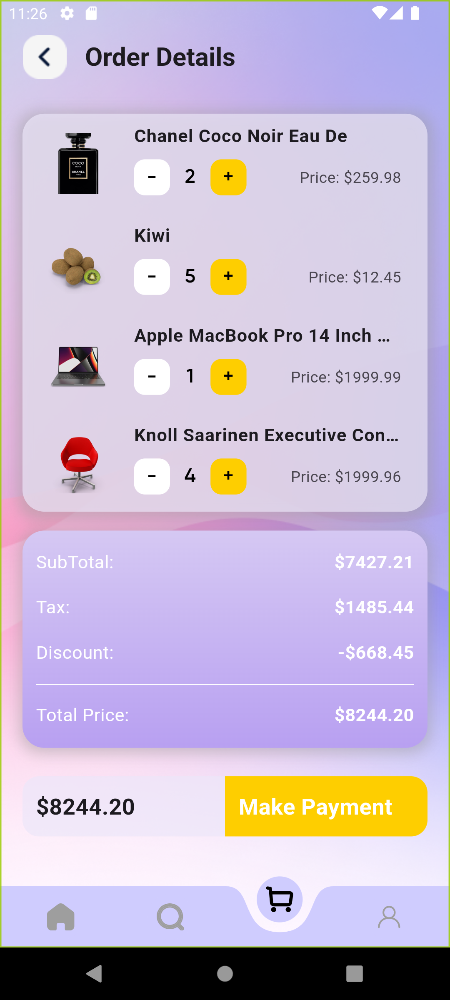

# SnapCart

SnapCart, kullanıcıların ürünleri görüntüleyebileceği, sepete ekleyebileceği ve sepetlerini inceleyebileceği bir Flutter uygulamasıdır.  
Bu uygulama, özellikle mobil uygulama tasarımı ve mimari yapılar üzerinde çalışmak için geliştirilmiştir. Uygulamada **Riverpod** kullanılarak, durum yönetimi modern ve etkili bir şekilde ele alınmıştır.


## Özellikler
- **Ürün Listeleme:** Kullanıcılar mevcut ürünleri liste halinde görüntüleyebilir.
- **Sepete Ekleme:** Kullanıcılar ürünleri sepete ekleyebilir.
- **Sepet Görüntüleme:** Kullanıcılar, sepetteki ürünlerin listesini görüntüleyebilir ve toplam tutarı inceleyebilir.
- **Kullanıcı Girişi:** Belirtilen kullanıcı adı ve şifre ile giriş yapabilirsiniz.

## Giriş Bilgileri
- **Kullanıcı Adı:** `emilys`
- **Şifre:** `emilyspass`

> *Uygulamanın giriş ekranında bu bilgileri kullanarak test edebilirsiniz.*

## Ekran Görüntüleri
### Kullanıcı Girişi


### Ana Sayfa


### Ürün Detay 


### Ürün Detay 


### Sepet



## Kurulum
Projeyi kendi cihazınıza kurmak için aşağıdaki adımları izleyin:

1. **Depoyu Klonlayın:**
   ```bash
   git clone https://github.com/kullaniciadi/snap_cart.git
   cd snap_cart
